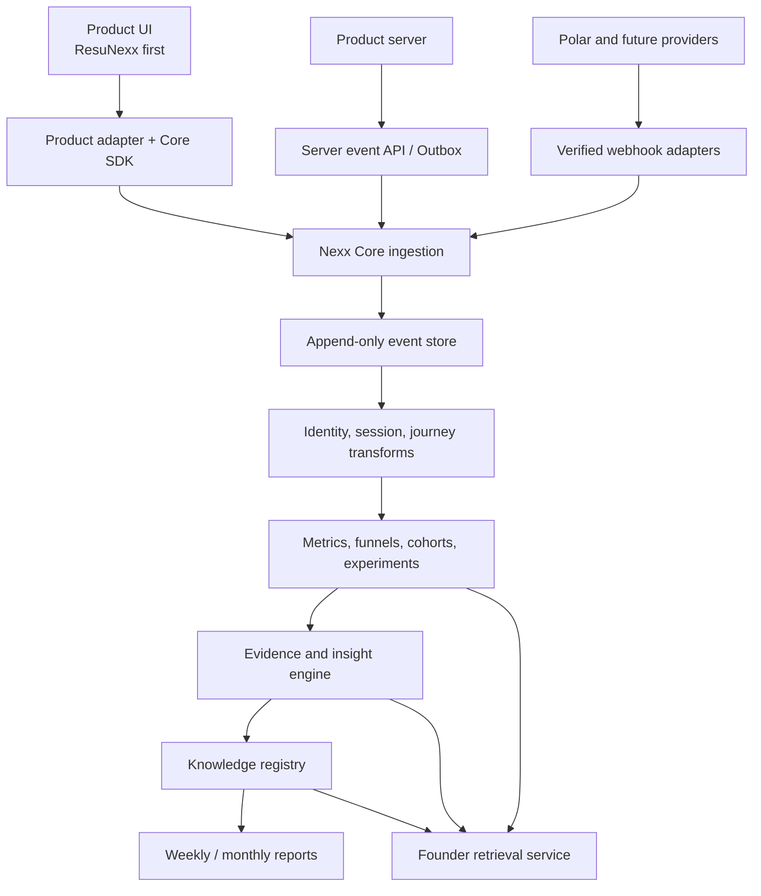
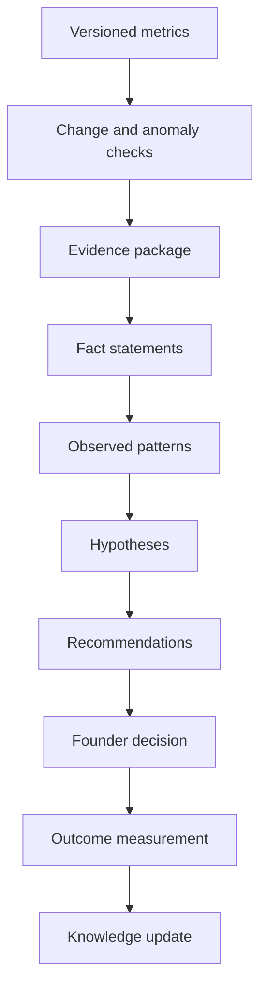
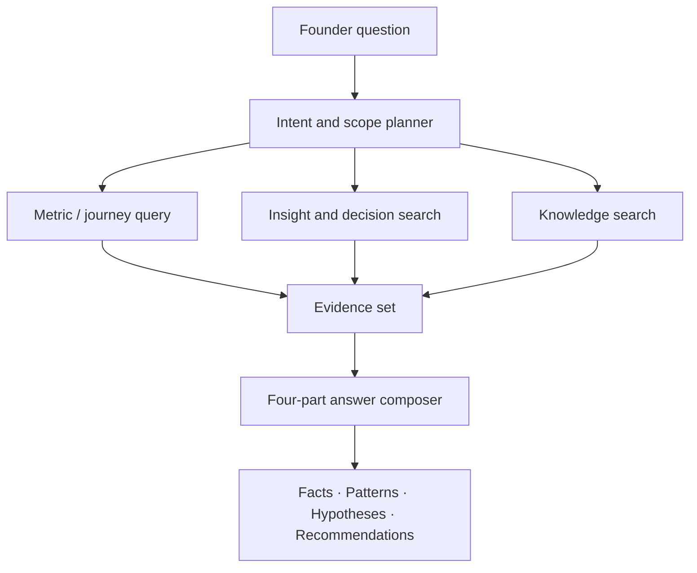

# Nexx Core Learning Infrastructure V1

**Architecture Specification — Approved V1.1**
**Date:** 2026-07-25
**Status:** Phase 1 local/non-production foundation authorized on 2026-07-26; production remains prohibited
**First product adapter:** ResuNexx
**Primary optimization target:** The next 10 Nexx products, not ResuNexx alone

---

## 0. Executive decision

Nexx Core V1 should be built as a **shared learning substrate** that products plug into, not as an analytics module embedded inside ResuNexx.

Its job is to turn product activity into a durable sequence:

> Event → Customer Journey → Governed Metric → Evidence → Observed Pattern → Hypothesis → Recommendation → Founder Decision → Experiment or Product Change → Measured Outcome → Reusable Knowledge → Governed AI Retrieval → Better Future Decision

The correct V1 architecture is a **modular monolith backed by PostgreSQL**, with clear internal boundaries and versioned contracts. This is intentionally simpler than a microservice architecture, but the boundaries make later separation possible. A solo founder should not pay the operational cost of Kafka, a separate warehouse, a vector database, and multiple services before data volume requires them.

Nexx Core V1 has five non-negotiable properties:

1. **Append-only evidence:** raw events are immutable facts about what the system received.
2. **Server authority:** payment, upload completion, analysis completion, and report generation are confirmed by server-side events, not browser claims.
3. **Versioned meaning:** event contracts, metrics, funnels, experiments, insight logic, and reports are versioned.
4. **Evidence before language:** deterministic computation creates facts and observed patterns; an AI model may explain them, propose hypotheses, and draft recommendations, but may not invent evidence.
5. **Transferable learning:** every knowledge item states whether it is product-specific, a reusable pattern, or a validated cross-product insight.

This is not a dashboard project. A dashboard may eventually be one view over Nexx Core, but it is not the architecture or the product objective.

---

## 1. Scope and architectural boundaries

### 1.1 Nexx Core owns

- Product and environment registry
- Canonical event taxonomy and schema versions
- Client and server event ingestion contracts
- Consent, pseudonymous identity, sessions, and deterministic identity stitching
- Raw event storage
- Customer journey and conversion-path models
- Metric, funnel, cohort, content, and experiment definitions
- Derived learning tables
- Evidence bundles and traceability
- Insight, hypothesis, recommendation, decision, and outcome records
- Weekly and monthly learning reports
- Cross-product knowledge classification and lifecycle
- Founder-facing retrieval APIs
- Data quality, privacy, retention, deletion, and audit controls

### 1.2 Product adapters own

Each product owns its domain behavior and emits canonical events through a thin adapter.

For ResuNexx, the adapter owns:

- Mapping ResuNexx pages, resource articles, CTA locations, plans, analysis states, reports, and Polar payment states to Nexx Core contracts
- Normalizing target roles into a controlled taxonomy before sending analytical properties
- Emitting authoritative server events when analysis and payment states change
- Maintaining the relationship between a Nexx Core pseudonymous actor and ResuNexx domain records
- Enforcing the rule that resume text, file contents, email addresses, and generated report contents do not enter the analytics event payload

### 1.3 Nexx Core does not own in V1

- Resume parsing, scoring, rewriting, or report composition
- Carbon readiness rules
- Product-specific UI
- A founder dashboard
- Advertising platform synchronization
- Real-time personalization
- Predictive lifetime-value models
- Automatic business decisions without founder approval

---

## 2. Overall system architecture



### 2.1 Recommended deployment shape

Use one deployable Nexx Core application initially, divided into internal modules:

- `registry`
- `ingestion`
- `identity`
- `journeys`
- `metrics`
- `experiments`
- `insights`
- `knowledge`
- `reports`
- `retrieval`
- `governance`

Use one PostgreSQL cluster with separate schemas:

- `core_registry`
- `core_raw`
- `core_learning`
- `core_intelligence`
- `core_knowledge`
- `core_governance`

Product domain tables remain outside these schemas. The first deployment may share a database cluster with ResuNexx if necessary for speed, but Core tables must have separate ownership, migrations, roles, and naming. This allows later physical separation without redesigning contracts.

### 2.2 Processing model

V1 uses two paths:

- **Synchronous acceptance:** validate, authenticate, assign receipt metadata, deduplicate, and persist the event.
- **Asynchronous learning:** sessionize, build journeys, compute metrics, detect changes, generate evidence packages, and build reports.

Analytics failure must never block a user from uploading, analyzing, paying, or downloading a report. Product actions complete first; their Core events are delivered through a retryable server outbox.

### 2.3 Why no microservices yet

Microservices would add deployment, networking, observability, data consistency, and incident-response costs before Nexx Core has enough load to justify them. The module boundaries and APIs in this specification are the future service boundaries. Separation should occur only when a measured bottleneck exists.

---

## 3. Canonical identity and tenancy model

Nexx Core must support both anonymous visitors and known customers without assuming every product uses accounts.

### 3.1 Core hierarchy

| Entity | Purpose |
|---|---|
| `nexx_organization` | The owner of one or more products; initially the founder’s Nexx organization |
| `product` | ResuNexx, CarbonNexx, SEA Engine, Shangs, or a future product |
| `product_environment` | Production, staging, development; data never mixes silently |
| `actor` | A pseudonymous person or account-level subject |
| `actor_identity` | A product user ID, anonymous browser ID, or separately protected hashed identifier |
| `session` | A bounded period of product interaction |

### 3.2 Identity rules

- Generate a first-party `anonymous_id` and store it in a privacy-compliant cookie or equivalent local identifier.
- Never use browser fingerprinting.
- If a user later signs in, submits an email, or completes payment, connect identities only through a deterministic server-confirmed relationship.
- Never probabilistically merge people across devices.
- Store direct identifiers, when operationally required, in the product domain or a protected identity vault—not in raw event properties.
- Cross-product identity linking must be opt-in or justified by the applicable privacy notice and legal basis.
- A deletion request must remove or irreversibly anonymize the actor linkage while allowing non-identifying aggregates to remain.

### 3.3 Session rules

Default sessionization:

- New session after 30 minutes of inactivity
- New session when campaign attribution changes materially
- Server events may attach to the most recent valid session or remain sessionless
- Session logic is versioned so historical reports remain reproducible

---

## 4. Event architecture

### 4.1 Event envelope

Every event uses the same envelope. Product-specific details live only in validated `properties`.

```json
{
  "event_id": "uuid",
  "event_name": "checkout.started",
  "event_version": 1,
  "occurred_at": "2026-07-25T12:34:56.000Z",
  "product_key": "resunexx",
  "environment": "production",
  "source": "client|server|webhook|backfill",
  "anonymous_id": "opaque-id",
  "actor_id": "optional-core-actor-id",
  "session_id": "optional-session-id",
  "page": {
    "url_path": "/pricing",
    "canonical_page_key": "pricing",
    "referrer_host": "chatgpt.com"
  },
  "acquisition": {
    "source": "chatgpt",
    "medium": "referral",
    "campaign": null,
    "referrer_class": "ai_search"
  },
  "device": {
    "category": "mobile",
    "browser_family": "safari",
    "os_family": "ios"
  },
  "geo": {
    "country_code": "TW"
  },
  "properties": {},
  "consent": {
    "analytics": true,
    "policy_version": "2026-07-01"
  },
  "idempotency_key": "provider-or-client-key"
}
```

### 4.2 Required storage fields

The database adds:

- `received_at`
- `ingestion_request_id`
- `schema_validation_status`
- `schema_validation_errors`
- `is_bot`
- `data_classification`
- `retention_class`
- `source_ip_country` if derived
- `processing_status`
- `supersedes_event_id` only for explicit correction records

Raw events are never updated to change history. A correction is a new event referencing the earlier event.

### 4.3 Canonical event naming

Use `object.action` in past tense or lifecycle form. Event meaning must be stable; changing meaning requires a new version.

| Journey area | Canonical event | Key properties |
|---|---|---|
| Acquisition | `page.viewed` | page key, page type, content key |
| Engagement | `engagement.scroll_threshold_reached` | 25, 50, 75, or 90 |
| Engagement | `engagement.time_accumulated` | active seconds, visibility-qualified |
| CTA | `cta.clicked` | CTA key, placement, destination intent |
| Content | `content.viewed` | content key, content type, topic tags |
| Content | `sample_artifact.viewed` | artifact type, version |
| Upload | `artifact_upload.started` | artifact type |
| Upload | `artifact_upload.completed` | artifact type, size band; server authoritative |
| Upload | `artifact_upload.failed` | safe error category; no file name or content |
| Context | `assessment.context_provided` | context type, normalized value |
| Analysis | `assessment.started` | assessment type, engine version |
| Analysis | `assessment.completed` | assessment type, engine version, duration band |
| Analysis | `assessment.failed` | safe failure category |
| Report | `report.viewed` | report tier, report template version |
| Report | `report.downloaded` | format, report tier |
| Pricing | `pricing.viewed` | pricing version |
| Plan | `plan.selected` | plan key, price version, currency |
| Checkout | `checkout.started` | checkout ID, plan key |
| Payment | `payment.completed` | transaction ID, plan key, amount, currency; webhook only |
| Payment | `payment.failed` | attempt ID, safe failure category; webhook only |
| Return | derived, not emitted | based on actor’s prior sessions |
| Exit page | derived | last qualified page in session |

### 4.4 ResuNexx mapping

The requested customer interactions map as follows:

| Requested interaction | V1 representation |
|---|---|
| Google Search | `acquisition.referrer_class=organic_search`, `source=google` |
| AI Search | `referrer_class=ai_search`; provider classified when evidence exists |
| ChatGPT / Claude / Perplexity | normalized source based on known referrer or explicit campaign |
| Direct traffic | no qualifying referrer or campaign; classification version retained |
| Resource article visited | `content.viewed`, content type `resource_article` |
| Target role entered | `assessment.context_provided`; normalized role family, never free text in analytics |
| Resume analysis started/completed | canonical assessment lifecycle events |
| Report/sample report viewed | report or sample-artifact event |
| Return visit | derived from previous qualified session |
| Exit page | derived from final qualified page event |
| Time on page | active foreground time summarized, not naive wall-clock time |

Referrer classification is evidence, not certainty. Browsers and AI applications may suppress referrers. Reports must include an `unknown` bucket and must never relabel unknown traffic as direct proof of an AI referral.

### 4.5 Client versus server authority

| Event | Accepted source |
|---|---|
| Page, scroll, CTA, pricing view | Client |
| Upload started | Client or server |
| Upload completed | Server |
| Assessment started/completed/failed | Server |
| Report generated | Server |
| Report viewed/download clicked | Client, optionally confirmed by server delivery |
| Checkout started | Server preferred |
| Payment completed/failed | Verified provider webhook only |

If client and server events describe the same lifecycle step, they must use different event meanings or a shared idempotency key. Double counting is not permitted.

### 4.6 Data minimization rules

Never place the following in event payloads:

- Resume file contents or extracted text
- User email, name, phone number, or full address
- Full target-role free text
- Generated report narrative
- Payment card or bank data
- Provider webhook secrets or raw webhook bodies
- Full IP address
- URL query strings that may contain personal data
- Stack traces, prompt contents, or model outputs

Safe analytical properties use controlled categories, IDs, booleans, bounded numbers, duration bands, and version identifiers.

---

## 5. Database schema

The following is the logical V1 schema. Physical indexes and partitions are finalized after the current ResuNexx stack is audited.

### 5.1 Registry and contracts

| Table | Important fields |
|---|---|
| `products` | id, organization_id, key, name, status, created_at |
| `product_environments` | id, product_id, environment, public_key, server_key_hash, status |
| `event_definitions` | event_name, owner_module, description, sensitivity |
| `event_schema_versions` | event_name, version, JSON schema, status, effective_at |
| `property_definitions` | property key, type, allowed values, PII rule |
| `page_registry` | product_id, page_key, page_type, canonical_path, active dates |
| `content_registry` | product_id, content_key, type, topic taxonomy, version |
| `cta_registry` | product_id, cta_key, intent, placement taxonomy, copy version |
| `plan_registry` | product_id, plan_key, pricing version, amount, currency, active dates |

### 5.2 Raw and identity

| Table | Important fields |
|---|---|
| `events` | complete event envelope, received metadata, JSONB properties |
| `event_rejections` | request ID, schema errors, safe payload fingerprint |
| `actors` | core actor ID, first_seen_at, last_seen_at, deletion state |
| `actor_identities` | actor ID, product ID, identity type, protected value hash, validity |
| `identity_links` | two identities, deterministic reason, source event, created_at |
| `sessions` | actor/anonymous ID, start/end, attribution, entry/exit, engagement |
| `consent_records` | actor/anonymous ID, purpose, state, policy version, timestamp |

Recommended raw-event indexes:

- `(product_id, environment, occurred_at)`
- `(event_name, occurred_at)`
- `(actor_id, occurred_at)`
- `(anonymous_id, occurred_at)`
- `(session_id, occurred_at)`
- unique `(product_environment_id, event_id)`
- unique `(product_environment_id, idempotency_key)` when not null

Partition raw events monthly by `received_at` only when table size justifies it; do not introduce premature partition operations.

### 5.3 Customer learning schema

| Table | Purpose |
|---|---|
| `journey_touchpoints` | Ordered, qualified customer interactions |
| `conversion_paths` | Versioned path from acquisition through a defined conversion |
| `actor_learning_profiles` | Derived first/last seen, session count, purchase and engagement summaries |
| `actor_segments` | Time-bounded segment membership with definition version |
| `content_engagement_daily` | Views, qualified views, engagement, CTA and conversion linkage |
| `feature_usage_daily` | Product-neutral feature key usage |
| `report_engagement` | View/download/return behavior by report type and version |
| `purchase_summary` | Attempts, completions, refunds if added, value and plan history |
| `returning_visitor_cohorts` | Cohort definitions and return windows |
| `attribution_results` | First touch, last non-direct, and declared model outputs |
| `funnel_observations` | Entry, progression, completion, drop-off by funnel version |
| `trend_observations` | Metric values by period and comparison window |

Derived tables retain:

- `definition_version`
- `computed_at`
- `source_window_start`
- `source_window_end`
- `source_event_count`
- `job_run_id`

This makes every result reproducible.

### 5.4 Experiment schema

| Table | Purpose |
|---|---|
| `experiments` | Name, product, hypothesis, owner, status, start/end |
| `experiment_variants` | Control and treatment definitions |
| `experiment_assignments` | Actor/session assignment and assignment event |
| `experiment_metric_bindings` | Primary, guardrail, and diagnostic metrics |
| `experiment_observations` | Counts, effect, uncertainty, validity checks |
| `experiment_decisions` | Continue, stop, ship, reject; decision evidence |
| `product_changes` | Approved non-experiment change, release, expected effect, guardrails, reversal condition |
| `outcome_measurements` | Versioned measured result for an experiment or product change |

An experiment must exist in the registry before assignments are emitted. Post-hoc segmentation must not be presented as a randomized experiment.

---

## 6. Customer Learning Model

Raw events alone do not create learning. Nexx Core constructs six durable learning views.

### 6.1 Journey

An ordered set of qualified touchpoints:

- Discovery
- Landing
- Content education
- Product intent
- Assessment action
- Report engagement
- Pricing intent
- Checkout
- Payment
- Return and reuse

Journey stages are generic. Products map their actions to stages through versioned configuration.

### 6.2 Conversion paths

Store the full eligible path, not only one attribution answer. Compute at least:

- First touch
- Last non-direct touch
- Last content touch
- Path length
- Time to conversion
- Assisted content and CTA touches

V1 must avoid claiming causal attribution. “Conversions with this article in the path” is a fact; “this article caused the conversion” is not.

### 6.3 Actor learning profile

The profile contains derived behavioral facts, not personal dossiers:

- First and latest qualified activity
- Session count and return windows
- Acquisition history
- Content-topic affinity
- Workflow progression
- Report engagement
- Purchase history and value
- Current segment memberships
- Experiment exposure
- Recommendation/outcome history when known

### 6.4 Segment model

Segments are versioned queries, for example:

- New visitor
- Returning non-buyer
- Report viewer without pricing view
- Checkout abandoner
- Paid Standard customer
- Paid Elite customer
- Organic-search resource reader
- AI-referral visitor with qualified engagement
- Normalized role family
- Country or region cohort

Segment membership always records the definition version and evaluation time.

### 6.5 Outcome loop

Recommendations create value only if outcomes return to the engine. V1 therefore records:

- Recommendation shown
- Recommendation accepted, rejected, deferred, or not reviewed by founder
- Test created from recommendation
- Experiment or product change approved and deployed
- Expected metric and evaluation window
- Measured outcome
- Learning confirmed, weakened, contradicted, or inconclusive

This loop is the beginning of the Self-Growing Business Engine.

A recommendation is not knowledge merely because it was accepted or
implemented. It may become `supported` knowledge only after the defined
evaluation window closes, a governed outcome is recorded, source evidence and
counter-evidence are linked, and a human review approves the promotion.

### 6.6 Historical truth

Definitions change. Nexx Core never silently rewrites old conclusions using new definitions. It can recompute a new version, but the old observation remains connected to its original metric, funnel, and schema versions.

---

## 7. Business Intelligence architecture

### 7.1 Semantic metric layer

All business claims reference a registered metric.

`metric_definitions` includes:

- Metric key and plain-language definition
- Numerator and denominator
- Eligible event sources
- Exclusions, bot rules, and consent rules
- Grain: actor, session, event, transaction, or content
- Time zone and attribution model
- Minimum sample threshold
- Metric version
- Owner and approval state

Initial metrics:

- Qualified sessions
- Landing-to-CTA rate
- CTA-to-upload-start rate
- Upload completion rate
- Assessment completion rate
- Report-view rate
- Pricing-view rate
- Plan-select rate
- Checkout-start rate
- Payment conversion rate
- Payment failure rate
- Report download rate
- Return rate at 7 and 30 days
- Qualified content engagement rate
- Assisted conversion rate by content item
- Revenue per qualified session

### 7.2 Insight pipeline



### 7.3 Evidence package

Every insight run stores:

- Metric definition and version
- Current period and comparison period
- Numerator, denominator, absolute value, and change
- Sample size
- Segment and filters
- Data freshness
- Event-source coverage
- Known quality warnings
- Supporting query hash and job run
- Links to aggregate observations, not unrestricted PII

### 7.4 Required separation of reasoning

Every intelligence output contains four typed sections:

1. **Facts:** Directly computed values.
2. **Observed Patterns:** Descriptive relationships or repeated movements in evidence.
3. **Hypotheses:** Possible explanations that are explicitly unproven.
4. **Recommendations:** Proposed actions connected to evidence, expected effect, cost, risk, and test.

The system must reject report output that puts a hypothesis in a fact field.

### 7.5 Statistical and evidence guardrails

- Always display sample size and comparison window.
- Default to no directional recommendation when the sample is below the metric threshold.
- Use “insufficient evidence” as a valid conclusion.
- Do not infer causality from observational paths.
- Do not rank a page on conversion rate without also showing eligible sessions and conversions.
- Separate absolute change from relative percentage change.
- Identify instrumentation or traffic-mix changes before suggesting product causes.
- Compare like-for-like periods when seasonality, weekday mix, or campaign timing matters.
- Multiple comparisons and experiment stopping rules must be documented.

Initial conservative defaults:

- Descriptive rate shown: at least 20 eligible observations
- Ranked conversion item: at least 20 eligible sessions and 3 conversions
- Strong recommendation: at least 50 eligible sessions or a validated experiment
- Cross-product claim: evidence from at least two products and an explicit transfer validation

These are operating guardrails, not universal statistical guarantees, and should be revised with real volume.

### 7.6 Insight storage

| Table | Purpose |
|---|---|
| `metric_definitions` | Versioned semantic metrics |
| `metric_observations` | Computed values and counts |
| `insight_runs` | Time window, job version, quality status |
| `insight_claims` | Typed fact, pattern, hypothesis, or recommendation |
| `evidence_refs` | Claim-to-observation/query/report links |
| `anomalies` | Detected change and severity |
| `data_quality_incidents` | Missing events, schema drift, delays |

---

## 8. Decision Intelligence architecture

Decision Intelligence is a governed workflow, not an unbounded chatbot.

### 8.1 Decision object

Each material founder decision stores:

- Question
- Decision context
- Relevant facts
- Observed patterns
- Competing hypotheses
- Options considered
- Recommendation
- Founder decision
- Expected outcome
- Guardrails and reversal condition
- Evaluation date
- Actual outcome
- Resulting knowledge items

### 8.2 Recommendation object

Each recommendation includes:

- Proposed action
- Supporting evidence references
- Target metric
- Expected direction and plausible magnitude range when supportable
- Confidence and rationale
- Effort and cost category
- Risk and guardrail metrics
- Suggested test design
- Earliest reliable evaluation date
- Applicability scope

### 8.3 Human approval

V1 may draft and prioritize recommendations, but it may not:

- Change prices
- Publish content
- Alter production user flows
- Start or stop campaigns
- Modify product logic
- Contact customers

without explicit founder approval and a separately authorized implementation workflow.

### 8.4 Learning lifecycle

Knowledge states:

- `proposed`
- `under_review`
- `testing`
- `supported`
- `contradicted`
- `narrowed`
- `superseded`
- `retired`

Confidence is not only a model score. It is derived from evidence strength, sample adequacy, recency, replication, and whether the evidence is observational or experimental.

All lifecycle transitions are append-only review records. A transition to
`supported` requires a measured outcome and may never be performed solely by an
AI model. Contradiction, narrowing, supersession, and retirement preserve the
prior statement, evidence, scope, decision history, and retrieval visibility
that applied at the time.

---

## 9. Cross-product learning architecture

### 9.1 Knowledge item

Each reusable learning is a first-class record:

| Field | Meaning |
|---|---|
| `knowledge_key` | Stable identifier |
| `statement` | The learning in plain language |
| `scope_type` | Product-specific, reusable pattern, cross-product insight |
| `source_products` | Products that produced evidence |
| `applicable_product_archetypes` | Assessment, content-led, marketplace, service-led, etc. |
| `conditions` | When the learning may apply |
| `non_applicability` | Known boundaries |
| `evidence_refs` | Supporting observations and experiments |
| `confidence` | Structured evidence confidence |
| `status` | Proposed through retired |
| `owner` | Human accountable for approval |
| `valid_from` / `review_at` | Lifecycle |
| `supersedes` | Prior knowledge relationship |
| `counter_evidence_refs` | Evidence that weakens or bounds the statement |
| `version` | Immutable knowledge version |
| `review_history` | Human review and lifecycle transitions |

### 9.2 Scope rules

**Product-specific**

- Evidence exists only in one product.
- The mechanism relies on a domain-specific behavior.
- Example: users targeting a particular resume role respond to a specific report section.

**Reusable Pattern**

- A plausible mechanism could apply elsewhere, but has not yet been validated in another product.
- Example: sample-report viewing appears to reduce uncertainty before checkout.

**Cross-product Insight**

- Evidence exists in at least two products.
- The shared mechanism and boundary conditions are stated.
- A transfer test or repeated observational result supports the classification.

The system must not automatically promote a single-product observation to “cross-product.”

### 9.3 Transfer workflow

1. Create product-specific learning.
2. Founder or engine marks it as a reusable-pattern candidate.
3. Define the mechanism and conditions, not only the UI treatment.
4. Create a transfer test in another product.
5. Measure outcome using comparable metric definitions.
6. Validate, narrow, contradict, or supersede the pattern.
7. Promote to cross-product only with evidence.

### 9.4 Shared taxonomies

Cross-product comparison requires canonical dimensions:

- Journey stage
- Acquisition channel
- Page/content type
- CTA intent
- Workflow stage
- Product archetype
- Purchase state
- Engagement level
- Experiment type
- Recommendation type
- Outcome type

Domain-specific details remain in product extensions.

---

## 10. AI Retrieval architecture

### 10.1 Principle

The founder asks a natural-language question. Nexx Core plans a retrieval against governed sources, builds an evidence set, and only then generates an answer.



### 10.2 Retrieval sources

Priority order:

1. Registered metric observations
2. Funnel, journey, cohort, experiment, and trend observations
3. Existing insight claims with evidence
4. Decision history and measured outcomes
5. Validated knowledge items
6. Weekly/monthly report snapshots

Raw events are queried only through approved views or parameterized analysis jobs. The AI model does not receive unrestricted raw-event or identity-table access.

### 10.3 Query planning

The planner resolves:

- Product scope
- Environment
- Time window and comparison period
- Metric definitions and versions
- Segment/cohort
- Attribution model
- Evidence threshold
- Data freshness

If required information is ambiguous, the answer states the chosen assumption or asks for clarification.

### 10.4 Retrieval technology

V1:

- PostgreSQL structured queries
- Full-text search over insight, decision, report, and knowledge text
- Curated retrieval views
- Parameterized metric and funnel query templates

Later:

- Embeddings over non-sensitive knowledge, decisions, and reports
- A vector index only when full-text retrieval is measurably insufficient
- A separate analytical warehouse only when production database workload or volume requires it

Do not embed raw resume content or raw event payloads for founder retrieval.

### 10.5 Answer contract

Every answer returns:

- Scope and time window
- Data freshness
- Facts
- Observed Patterns
- Hypotheses
- Recommendations
- Evidence references
- Caveats and unknowns

An unsupported question should return “insufficient evidence” and specify what data or test would answer it.

Every retrieval request records the tool version, caller, authorized product
scope, query parameters, source record IDs, definition versions, and citations.
Quantitative facts must come from governed structured queries. Semantic
retrieval may use only approved evidence summaries, experiment conclusions,
decision records, and eligible knowledge versions. It may not use raw resume
content, direct identifiers, or unreviewed model prose.

---

## 11. Weekly Learning Report architecture

### 11.1 Purpose

The weekly report is a decision document and knowledge-ingestion cycle. It is not a PDF screenshot of charts.

### 11.2 Schedule and snapshot

- Generate after a fixed weekly cutoff in the founder’s time zone.
- Use an immutable report snapshot containing metric versions, query hashes, and data freshness.
- Compare to the prior week and a rolling four-week baseline where volume permits.
- Mark incomplete weeks or instrumentation changes.

### 11.3 Required sections

1. **Executive learning summary**
2. **What happened?**
3. **What changed?**
4. **Evidence-backed observed patterns**
5. **What may explain it?** — hypotheses only
6. **Largest journey drop-offs**
7. **Acquisition, content, CTA, pricing, checkout, and payment findings**
8. **Experiments and outcomes**
9. **What should be tested next?**
10. **What should not be repeated?**
11. **Reusable knowledge created**
12. **What future Nexx products may learn**
13. **Data quality and unknowns**
14. **Founder decisions required**

### 11.4 Generation method

1. Compute deterministic metrics.
2. Run quality and sample checks.
3. Detect changes and candidate patterns.
4. Build evidence packages.
5. Generate typed claims.
6. Use AI to draft concise explanations and hypotheses.
7. Validate every factual sentence against evidence references.
8. Persist the report and its claims.
9. Await founder review before promoting knowledge or acting on recommendations.

### 11.5 Report status

- Draft
- Data-validated
- Founder-reviewed
- Final
- Superseded

---

## 12. Monthly Learning Report architecture

The monthly report consolidates weeks but recomputes monthly metrics from source observations; it does not average weekly percentages.

### 12.1 Required sections

- Growth and qualified demand
- Traffic mix and acquisition changes
- Customer journey and conversion
- Content and GEO learning
- Report and feature engagement
- Pricing, checkout, payment, and revenue
- User segments and returning behavior
- Experiment portfolio
- Decisions made and outcomes
- Knowledge gained, contradicted, and expired
- Cross-product reusable patterns
- Engine growth and data quality
- Priorities for the next month

### 12.2 Engine growth metrics

Nexx Core should measure its own growth:

- Percentage of critical journey events instrumented
- Valid-event rate
- Server-authoritative coverage of critical events
- Percentage of insights with complete evidence
- Outcome-capture rate for recommendations
- Number of reviewed and validated knowledge items
- Reusable-pattern candidates
- Validated cross-product insights
- Knowledge reuse count
- Stale or contradicted knowledge count
- Time from behavior to reviewed learning
- Founder recommendation acceptance and measured success rate

These metrics distinguish engine growth from website traffic growth.

---

## 13. API architecture

### 13.1 Public product-facing APIs

| Method and path | Purpose |
|---|---|
| `POST /v1/events/batch` | Client event ingestion |
| `POST /v1/server-events/batch` | Authenticated product-server events |
| `POST /v1/webhooks/{provider}` | Verified provider webhook adapter |
| `POST /v1/identity/link` | Deterministic identity connection from trusted server |
| `POST /v1/consent` | Consent state updates |

### 13.2 Internal learning APIs

| Method and path | Purpose |
|---|---|
| `GET /internal/v1/metrics` | Versioned metric observations |
| `GET /internal/v1/funnels` | Funnel observations and evidence |
| `GET /internal/v1/journeys` | Aggregated journey views |
| `GET /internal/v1/insights` | Typed claims and evidence |
| `GET /internal/v1/knowledge` | Scoped knowledge retrieval |
| `POST /internal/v1/questions` | Governed founder question workflow |
| `POST /internal/v1/reports/weekly` | Scheduled report generation |
| `POST /internal/v1/reports/monthly` | Scheduled report generation |
| `POST /internal/v1/decisions` | Founder decision record |
| `POST /internal/v1/outcomes` | Outcome feedback |

### 13.3 API contract rules

- All writes accept idempotency keys.
- Product and environment scope is derived from credentials, not trusted from payload alone.
- Client keys can emit only allowed low-sensitivity events.
- Server keys are secret, environment-scoped, rotatable, and rate-limited.
- Webhooks require provider signature verification and replay protection.
- Batch size and payload size are bounded.
- Event timestamp skew is validated and marked when outside limits.
- Unknown properties are rejected in strict mode or quarantined during controlled migrations.
- Every response includes a request ID.

### 13.4 SDK

Provide a small product-neutral web SDK:

- `init(productKey, environment, consentState)`
- `track(eventName, properties)`
- `page(pageKey, metadata)`
- `identify(productUserId)` through trusted linkage rules
- `consent(update)`
- automatic batching, retry, and unload-safe transport

Provide a server SDK or shared package:

- schema validation
- idempotency
- outbox write
- server event signing
- canonical event helpers

SDKs must not contain ResuNexx event names.

---

## 14. Data flow architecture

### 14.1 Browser interaction

1. Product adapter maps UI action to canonical event.
2. SDK checks consent and property allowlist.
3. SDK batches and sends.
4. Ingestion authenticates environment and validates schema.
5. Event is deduplicated and appended.
6. Async jobs qualify bot status, session, journey, and learning views.

### 14.2 Authoritative product event

1. Product transaction succeeds.
2. Product database change and an outbox record are committed atomically where possible.
3. Worker sends signed event to Nexx Core.
4. Nexx Core deduplicates and persists.
5. Outbox marks delivery success; failures retry with backoff.

### 14.3 Payment

1. Product creates checkout and records checkout ID.
2. `checkout.started` is emitted from the server.
3. Polar sends a signed webhook.
4. Product verifies signature and updates its transaction state.
5. `payment.completed` or `payment.failed` is emitted through the outbox with provider transaction ID as idempotency basis.
6. Nexx Core joins payment to actor/session/path without receiving sensitive payment data.

### 14.4 Learning computation

1. Incremental transform reads newly accepted events.
2. Identity and session versions are applied.
3. Journey and learning tables are updated.
4. Metric jobs compute observations.
5. Quality checks run.
6. Insight candidates are generated.
7. Evidence packages and typed claims are stored.
8. Reports and retrieval indices update.

---

## 15. Security, privacy, and governance

### 15.1 Data classification

Use four classes:

- **Public:** page keys, public content taxonomy
- **Internal:** metrics, experiment configuration, recommendations
- **Pseudonymous:** actor IDs, session behavior, conversion paths
- **Restricted:** direct identity linkage, deletion mappings, provider transaction references

Resume contents and user contact data stay in the product’s restricted domain storage and are not Core event data.

### 15.2 Controls

- Encryption in transit and at rest
- Separate client, server, worker, founder-read, and migration database roles
- Row-level or equivalent product/environment isolation
- Secrets stored outside source control
- Audit log for schema changes, knowledge promotion, report finalization, and founder decisions
- Backups with tested restore procedures
- Dependency and migration review
- Rate limiting and abuse controls
- Bot and internal-traffic filters
- Production/staging separation
- Restricted founder retrieval views

### 15.3 Consent and transparency

- Define essential operational events separately from optional analytical events.
- Store consent purpose and policy version.
- Respect applicable regional consent requirements.
- Explain cross-product learning in privacy documentation before linking behavior across products.
- Provide deletion and access workflows.
- Do not collect data merely because it may be useful someday.

### 15.4 Retention

Initial policy proposal, subject to legal review:

- Rejected payload diagnostics: 30 days
- Raw pseudonymous events: 13 months
- Identity-link records: while operationally required, then delete/anonymize
- Aggregated observations without personal linkage: long-term
- Reports, decisions, experiments, and knowledge: long-term with evidence lineage
- Payment/accounting records: according to legal and provider obligations, preferably in product/finance systems

Retention class is set per event and property. A scheduled purge job and deletion audit are required.

### 15.5 AI safety

- AI receives evidence packages, not database credentials or unrestricted tables.
- Retrieval uses read-only, allowlisted views.
- Prompts and outputs are logged without sensitive raw customer content.
- Facts must be machine-verifiable against evidence references.
- Model-generated hypotheses are labeled.
- Recommendations require human approval.
- Provider training/retention settings must be reviewed before transmitting internal intelligence.

---

## 16. Data quality and observability

Nexx Core cannot learn reliably if instrumentation silently breaks.

Required monitors:

- Ingestion success and rejection rate
- Event volume by product, environment, source, and event name
- Missing critical lifecycle pairs
- Client/server disagreement
- Duplicate rate
- Timestamp skew
- Unknown page, CTA, content, plan, or schema keys
- Webhook delay and failure
- Outbox backlog
- Transform freshness
- Metric freshness
- Consent coverage
- Internal/bot traffic contamination
- Sudden definition or traffic-source classification changes

A data-quality incident must be able to suppress affected insights and mark reports as incomplete.

---

## 17. Implementation roadmap

### Phase 0 — Architecture approval and ResuNexx audit

Before code:

- Approve this specification and open decisions.
- Inspect the actual ResuNexx repository, hosting, database, auth, Polar integration, analytics, privacy notice, deployment pipeline, and data model.
- Inventory all current pages, CTAs, reports, plans, payment states, and workflow transitions.
- Produce the ResuNexx-to-Core event mapping and data classification register.
- Define V1 success metrics and the current baseline if available.

**Exit criterion:** no unknown critical integration point remains.

### Phase 1 — Core foundation

- Product/environment registry
- Event definition and schema registry
- Core migrations and roles
- Client and server ingestion
- Deduplication and idempotency
- Consent records
- Raw event store
- Server outbox contract
- Data quality logging

**Exit criterion:** test product can send valid, rejected, duplicate, and retried events safely.

### Phase 2 — ResuNexx adapter

- Page/content/CTA/plan registries
- Acquisition and session capture
- Upload, assessment, report, pricing, checkout, and payment lifecycle events
- Polar verified webhook mapping
- No-PII payload tests
- Production/staging isolation
- End-to-end event verification

**Exit criterion:** a complete anonymous-to-payment journey is reconstructable from authoritative evidence.

### Phase 3 — Customer learning

- Sessionization
- Actor profile
- Journey touchpoints
- Conversion paths
- Returning cohorts
- Content/report engagement
- Initial segments
- First/last/last-non-direct attribution outputs

**Exit criterion:** known test journeys produce reproducible derived records.

### Phase 4 — Evidence-backed intelligence

- Metric registry
- Funnel definitions
- Metric and trend jobs
- Evidence packages
- Typed facts and observed patterns
- Sample/data-quality thresholds
- Initial weekly report

**Exit criterion:** every factual report statement resolves to a metric observation and evidence record.

### Phase 5 — Decision and knowledge loop

- Hypothesis, recommendation, decision, and outcome records
- Founder review workflow
- Knowledge registry and scope classification
- Monthly report
- Structured founder question endpoint

**Exit criterion:** one recommendation can be approved, tested, measured, and converted into a reviewed knowledge item.

### Phase 6 — Second-product onboarding

- Onboarding checklist and adapter template
- Shared taxonomy validation
- Transfer-test workflow
- Cross-product retrieval
- First reusable-pattern validation

**Exit criterion:** a second product integrates without changing the canonical Core contract for its basic journey.

---

## 18. Priority order

The priority is based on long-term learning value, not visible feature value.

1. Event definitions, schema versioning, and privacy rules
2. Server-authoritative lifecycle events and outbox reliability
3. Raw append-only evidence and data-quality controls
4. Identity, consent, session, and product/environment isolation
5. Journey, funnel, conversion path, and outcome schemas
6. Metric semantic layer and evidence packages
7. Weekly learning report
8. Decision/outcome workflow
9. Knowledge registry and scope lifecycle
10. Monthly report
11. Founder natural-language retrieval
12. Second-product adapter and transfer testing
13. Advanced prediction, vector retrieval, and separate warehouse

If a new ResuNexx feature competes with items 1–10, Core work wins unless the feature fixes a critical revenue, legal, security, or production-blocking defect.

---

## 19. Immediate ResuNexx components

Implement inside the ResuNexx product boundary after approval:

- `Nexx Core product adapter`
- Canonical page, resource, CTA, plan, report, and workflow key maps
- Client SDK initialization and consent integration
- Active engagement and scroll-threshold hooks
- Server outbox
- Authoritative upload/assessment/report lifecycle emissions
- Polar checkout and webhook event mapping
- Normalized target-role taxonomy mapping
- Analytics-payload privacy allowlist
- Event integration tests
- Staging and production configuration

These components translate product behavior; they do not own learning logic.

---

## 20. Components that belong in Nexx Core

- Product and environment registry
- Event registry, JSON schemas, validators, SDK contracts
- Ingestion, deduplication, and rejection handling
- Consent, identity, session, and journey processing
- Acquisition/referrer classifier
- Customer learning database
- Metric and funnel semantic layer
- Experiment records
- Evidence packages
- Insight and anomaly jobs
- Facts/patterns/hypotheses/recommendations contract
- Decision and outcome records
- Knowledge registry and cross-product scope lifecycle
- Weekly/monthly report engine
- Founder retrieval API
- Data quality, retention, deletion, and audits

---

## 21. Components to wait

Wait until evidence of need or a second product exists:

- Separate streaming platform
- Separate data warehouse/lakehouse
- Vector database
- Predictive lifetime-value and churn models
- Real-time recommendation engine
- Automated cross-product personalization
- Complex multi-touch causal attribution
- Benchmarking across products before comparable cohorts exist
- General-purpose experiment-management UI
- Self-service founder dashboard
- External customer analytics portal
- Automated actions without founder approval
- Marketplace or third-party Core integrations

Future capability is protected by contracts and data quality, not by building unused infrastructure now.

---

## 22. V1 acceptance criteria

Nexx Core Learning Infrastructure V1 is complete only when:

1. ResuNexx production and staging are registered separately.
2. All critical events validate against versioned schemas.
3. No restricted resume or identity content enters analytical payloads.
4. Payment facts originate only from verified server/provider flows.
5. Duplicate and retried events do not inflate metrics.
6. A full journey can be reconstructed across anonymous, known, and paid states.
7. Funnel and metric definitions are versioned and reproducible.
8. Each weekly-report fact links to supporting evidence.
9. Facts, observed patterns, hypotheses, and recommendations are stored separately.
10. Low-volume or incomplete data produces an explicit insufficient-evidence result.
11. A founder decision and its later outcome can be recorded.
12. A learning can be classified and reviewed without being falsely promoted to cross-product.
13. A product-neutral adapter template exists.
14. Data deletion, retention, and quality-failure paths are tested.
15. Analytics outages do not block the customer’s product journey.
16. A recommendation cannot become `supported` knowledge without a governed
    measured outcome and human review.
17. Product changes outside formal experiments have the same evidence,
    approval, outcome, and reversal traceability as experiments.
18. Knowledge contradiction, narrowing, supersession, and retirement preserve
    all historical versions and counter-evidence.
19. Quantitative founder answers are reproducible from allowlisted structured
    queries and include definition versions.
20. Every Core release, event schema, metric, funnel, attribution rule,
    pattern rule, knowledge record, retrieval tool, and report definition has a
    version that preserves historical meaning.

---

## 23. Open decisions requiring approval

Phase 0.5 resolves ordinary engineering choices through ADR-001 through
ADR-012. Remaining business and policy choices are intentionally limited to
the Founder Decision Register:

1. Consent experience and regional policy.
2. Retention periods.
3. Deletion and anonymization promise.
4. Permitted use of direct identifiers.
5. Founder-facing retrieval scope.
6. Cross-product learning and identity-sharing boundary.
7. Commercial definitions for governed pricing learning.
8. Founder authority for production and supported-knowledge promotion.

The repository boundary, modular-monolith shape, PostgreSQL system of record,
append-only event contract, versioning strategy, transformation model, and
retrieval implementation are engineering recommendations and do not require the
founder to design them. The founder approves only provider region/budget and the
policy choices above.

---

## 24. Architectural risks

| Risk | Consequence | Mitigation |
|---|---|---|
| Tracking everything without stable meaning | Large but unusable dataset | Versioned event and property registry |
| Browser events treated as truth | False conversions and lifecycle counts | Server authority matrix |
| PII enters event JSON | Privacy and retrieval risk | Property allowlists and payload tests |
| LLM writes conclusions directly | Unsupported business advice | Evidence packages and typed claims |
| Small samples are overinterpreted | Bad founder decisions | Minimum thresholds and insufficient-evidence state |
| ResuNexx logic leaks into Core | Future products require redesign | Product adapters and canonical journey taxonomy |
| “Reusable” is declared too early | False cross-product learning | Transfer-test lifecycle |
| Definition changes rewrite history | Reports become irreproducible | Versioned definitions and immutable snapshots |
| Analytics blocks production actions | Revenue and UX damage | Async outbox and failure isolation |
| Premature infrastructure complexity | Slow delivery and high maintenance | Modular monolith until measured scaling trigger |

---

## 25. Final architectural conclusion

The first durable asset is not the event table. It is the **closed learning loop with evidence and outcomes**.

ResuNexx should become the first instrumented product and the first source of learning, but it should not define the Core model. Nexx Core must understand generic products, journeys, content, workflows, purchases, experiments, decisions, and outcomes. ResuNexx contributes domain mappings and evidence; Nexx Core turns that evidence into reusable knowledge.

The implementation should begin only after:

- this architecture is approved,
- the actual ResuNexx production architecture is audited,
- the open decisions are resolved, and
- a concrete event and data-classification map is reviewed.

That sequence protects the long-term Self-Growing Business Engine while keeping V1 small enough for a solo founder to operate.

---

## 26. Phase 0.5 governance amendment

This review-draft amendment closes gaps verified against the actual ResuNexx
implementation and the complete required learning loop.

### 26.1 Governing loop

The governing architecture is incomplete if any link below is absent:

`Event -> Customer Journey -> Governed Metric -> Evidence -> Observed Pattern
-> Hypothesis -> Recommendation -> Founder Decision -> Experiment or Product
Change -> Measured Outcome -> Reusable Knowledge -> Governed AI Retrieval ->
Better Future Decision`

Events, dashboards, reports, and model summaries are views or inputs. None is
the learning system by itself.

### 26.2 Promotion invariant

No recommendation, report sentence, model output, or founder preference may be
promoted directly to supported knowledge. Promotion requires:

1. cited governed evidence;
2. a recorded hypothesis and recommendation;
3. a founder decision;
4. an experiment or traceable product change;
5. a versioned measured outcome;
6. supporting and counter-evidence;
7. explicit applicability and boundary conditions;
8. human approval of the knowledge version.

### 26.3 Historical-meaning invariant

Schema, metric, funnel, attribution, pattern, knowledge, retrieval, and report
definition changes create new versions. They never overwrite the version that
produced an earlier fact, decision, outcome, or answer.

### 26.4 Product-neutral invariant

Core contracts refer to registered products, environments, generic journey
stages, typed entities, governed definitions, and scoped knowledge. ResuNexx
plan names, resume fields, report prose, and product-specific workflow details
remain adapter concerns.

### 26.5 Governance references

The proposed systems of record, privacy/retrieval rules, and formal decisions
are maintained in:

- `Nexx_Core_Systems_of_Record_Specification.md`
- `Nexx_Core_Identity_Privacy_Consent_Retrieval_Governance.md`
- `adr/ADR-001` through `adr/ADR-012`

Those documents remain proposed until their stated approval conditions are
satisfied. This architecture document does not authorize Phase 1.

### 26.6 Approval record

On 2026-07-25, the founder approved Nexx Core Architecture V1.1 and the
recommended approach in ADR-001 through ADR-012. This approval accepts the
architecture direction and closes the ADR review item in Gate A. It does not
select the managed PostgreSQL provider, region, budget, or recovery objective;
therefore it does not yet authorize Phase 1 implementation.
